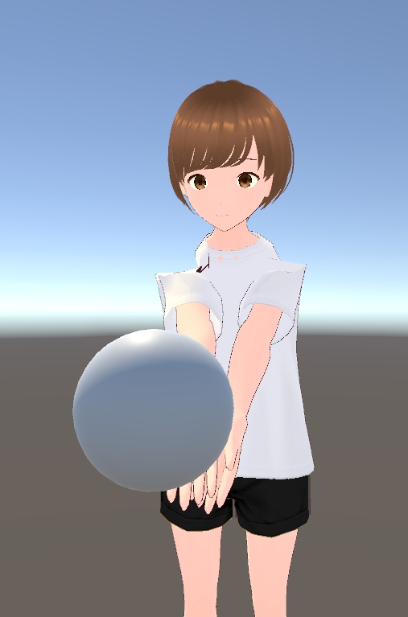

# SD_3DDrawCamera

(日本語版は[こちら](README_JP.md))

This is a [Unity](https://unity.com/) asset that allows you to convert each 3D object placed on the Unity editor into an illustration using the [Stable Diffusion web UI](https://github.com/AUTOMATIC1111/stable-diffusion-webui).  
This use [ControlNet for Stable Diffusion WebUI](https://github.com/Mikubill/sd-webui-controlnet).

It can be converted as below.
(Please check the sample scene for prompts etc.)



The version of Unity developed and tested is 2021.3.16f1.  
Please note that older versions are not supported.  
URP/HDRP is currently not supported.

## How to install

1. Install [Stable Diffusion web UI](https://github.com/AUTOMATIC1111/stable-diffusion-webui).

2. Edit webui-user.bat etc. and enable ``--api``.  
(For webui-user.bat, just add ``--api`` to ``COMMANDLINE_ARGS=``)

3. Start webui and install the following using "Install from URL" on the Extensions tab.
```
https://github.com/Mikubill/sd-webui-controlnet
```

4. Please store the following files in ``(webui Path)/models/ControlNet``.  
These can be downloaded [HERE (Hugging Face)](https://huggingface.co/lllyasviel/ControlNet-v1-1/tree/main).

- control_v11f1p_sd15_depth.pth
- control_v11f1p_sd15_depth.yaml
- control_v11p_sd15_normalbae.pth
- control_v11p_sd15_normalbae.yaml
- control_v11p_sd15s2_lineart_anime.pth
- control_v11p_sd15s2_lineart_anime.yaml

If you want to use the OpenPose function, you will also need the following (optional).

- control_v11p_sd15_openpose.pth
- control_v11p_sd15_openpose.yaml

5. Start Unity and create a new project.

6. Add the following git repository using the "+" button in Package Manager.
```
https://github.com/NON906/sd3DDraw.git?path=sd3DDraw/Assets/sd3DDraw
```
If you want to use the OpenPose function, you will also need the following ([UniVRM](https://github.com/vrm-c/UniVRM/releases/tag/v0.113.0)) (optional).

```
https://github.com/vrm-c/UniVRM.git?path=/Assets/VRMShaders#v0.113.0
https://github.com/vrm-c/UniVRM.git?path=/Assets/UniGLTF#v0.113.0
https://github.com/vrm-c/UniVRM.git?path=/Assets/VRM#v0.113.0
https://github.com/vrm-c/UniVRM.git?path=/Assets/VRM10#v0.113.0
```

7. If you want to use the function to output as a PSD file, please install [ImageMagick](https://imagemagick.org/script/download.php#windows) (optional).

## How to use

1. (If you want to illustrate the background) Attach the ``SDBackGround`` script to an empty game object and change settings such as prompts and weights.

2. Attach the ``SDDrawTarget`` script to the game object you want to illustrate (or its parent) and change settings such as prompts and weights.

3. Add ``Packages/online.mumeigames.sd3ddraw/Prefabs/ManagerAndCamera`` to the scene, change its position to reflect the object in 2., and change the settings of ``SDManager``.

4. Play the scene, and the ``Generate`` button will be displayed in the ``SDManager`` in step 3, so press it.

The contents that can be set in each script are as follows.

### SDBackGround

- Prompt, Negative Prompt:  
Stable Diffusion Prompt.
- Random Seed:  
Whether to use a random seed value.
- Seed:  
Current seed value. It changes every time you generate.

### SDDrawTarget

- Prompt, Negative Prompt:  
Stable Diffusion Prompt.
- Random Seed:  
Whether to use a random seed value.
- Seed:  
Current seed value. It changes every time you generate.
- Depth Weight:  
Weight for Depth. 0 if not used.
- Depth Control Mode:  
Control Mode for Depth. choose what to prioritize.
- Normal Weight, Normal Control Mode:  
Settings for Normal.
- Open Pose Weight, Open Pose Control Mode:  
Settings for OpenPose.  
Requires [UniVRM](https://github.com/vrm-c/UniVRM/releases/tag/v0.113.0) to use.
- Open Pose Prefab:  
Model used in OpenPose.  
If empty, specify ``Packages/online.mumeigames.sd3ddraw/Prefabs/OpenPose.prefab``.
- Lineart Weight, Lineart Control Mode:  
Settings for Lineart.  
If there are things such as facial expressions that are not reflected in Depth or Normal, please enable it.
- Reference Texture:  
When using Reference, set the target image.  
If this is specified, it will be generated to resemble the target image.  
- Reference Weight, Reference Control Mode:  
Reference weight and Control Mode.
- Change Materials:  
Change the material of the model to the default one when capturing Depth or Normal.  
If you turn it off, transparency and other areas may not be captured.
- Disable Background Mask:  
If ON, the background will not be made transparent and the background will also be generated at this prompt.  
If you use ``SDBackGround`` or if multiple ``SDDrawTarget`` exists, it will not work properly, so please turn it off.
- Use Alpha In Scene:  
If OFF (default), set Alpha value (transparent or not) by isnet-anime.  
If ON, use the Alpha value captured on the scene.  
I recommend turning it on only if turning it off doesn't work.
- Removal Pixels:  
Specifies how much surrounding pixels outside the masked area are made transparent.  
If this value is not present, protruding areas may be drawn.  
This is an option to prevent this, but if it is too large, the Alpha value may become blurry.

### SDManager

- Api Url:  
webui URL.
- Default Prompt, Default Nagative Prompt:  
The default prompt.  
Reflected in ``SDBackGround`` and all ``SDDrawTarget``.
- Draw Size:  
Output image size.
- Hires Fix Scale:  
The scale value of "Hires Fix".  
If set to 1, "Hires Fix" will not be used.
- Hires Fix Upscaler, Denoising Strength:  
Settings for "Hires Fix".
- Capture Camera:  
Camera to capture.
- Generate On Start:  
Whether to capture and generate illustrations at the start of playback.
- Save Directory:  
Where to save the illustration.  
Based on project folder.  
If this field is left blank, the file will be saved directly to the project folder.
- Save Png File:  
Whether to save as PNG.
- Save Psd File:  
Whether to save as PSD.  
To use it, you need to install [ImageMagick](https://imagemagick.org/script/download.php#windows).