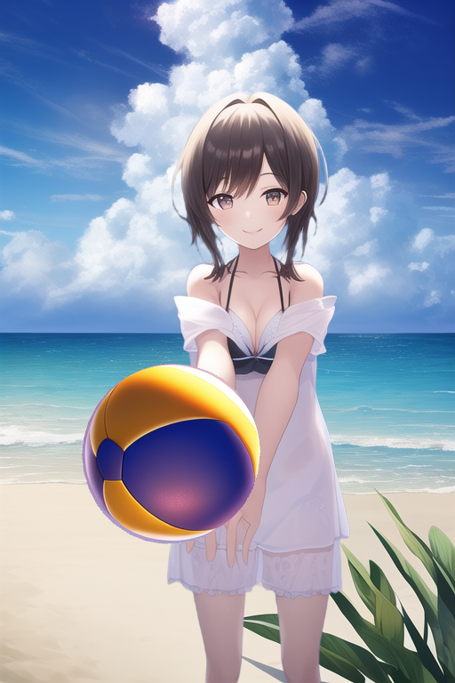

# SD_3DDrawCamera

[Unity](https://unity.com/ja)エディタ上で配置された各3Dオブジェクトを、[Stable Diffusion web UI](https://github.com/AUTOMATIC1111/stable-diffusion-webui)でイラストに変換できるようにした、Unityアセットです。  
[ControlNet for Stable Diffusion WebUI](https://github.com/Mikubill/sd-webui-controlnet)を使用しています。

以下のように変換することができます。  
（プロンプトなどはサンプルシーンから確認してください）



開発・動作確認したUnityのバージョンは2021.3.16f1です。  
これより昔のバージョンはサポートしませんのでご了承ください。  
URP・HDRPには今のところ未対応です。

## インストール方法

1. [Stable Diffusion web UI](https://github.com/AUTOMATIC1111/stable-diffusion-webui)をインストールしてください

2. webui-user.batなどを編集し、``--api``を有効にしてください  
(webui-user.batの場合は``COMMANDLINE_ARGS=``に``--api``を追加すればよいです)

3. webuiを起動し、拡張機能タブの「URLからインストール」で以下をインストールしてください
```
https://github.com/Mikubill/sd-webui-controlnet
```

4. ``(webuiのパス)/models/ControlNet``に以下のファイルを格納してください  
これらは[こちら（Hugging Face）](https://huggingface.co/lllyasviel/ControlNet-v1-1/tree/main)からダウンロードできます

- control_v11f1p_sd15_depth.pth
- control_v11f1p_sd15_depth.yaml
- control_v11p_sd15_normalbae.pth
- control_v11p_sd15_normalbae.yaml
- control_v11p_sd15s2_lineart_anime.pth
- control_v11p_sd15s2_lineart_anime.yaml

OpenPose機能を利用する場合は以下も必要です（任意）

- control_v11p_sd15_openpose.pth
- control_v11p_sd15_openpose.yaml

5. Unityを起動して、新しいプロジェクトを作成してください

6. Package Managerの「+」ボタンで以下のgitリポジトリを追加してください
```
https://github.com/NON906/sd3DDraw.git?path=sd3DDraw/Assets/sd3DDraw
```
OpenPose機能を利用する場合は以下（[UniVRM](https://github.com/vrm-c/UniVRM/releases/tag/v0.113.0)）も必要です（任意）
```
https://github.com/vrm-c/UniVRM.git?path=/Assets/VRMShaders#v0.113.0
https://github.com/vrm-c/UniVRM.git?path=/Assets/UniGLTF#v0.113.0
https://github.com/vrm-c/UniVRM.git?path=/Assets/VRM#v0.113.0
https://github.com/vrm-c/UniVRM.git?path=/Assets/VRM10#v0.113.0
```

7. PSDファイルで出力する機能を使用したい場合は[ImageMagick](https://imagemagick.org/script/download.php#windows)をインストールしてください（任意）

## 使用方法

1. （背景をイラスト化する場合）空のゲームオブジェクトに``SDBackGround``スクリプトをアタッチして、プロンプトや重みなどの設定を変更してください

2. イラスト化したいゲームオブジェクト（もしくはその親）に``SDDrawTarget``スクリプトをアタッチして、プロンプトや重みなどの設定を変更してください

3. ``Packages/online.mumeigames.sd3ddraw/Prefabs/ManagerAndCamera``をシーンに追加し、2.のオブジェクトを映すように位置を変更、および``SDManager``の設定を変更してください

4. シーンを再生し、3.の``SDManager``に``Generate``ボタンが表示されるので、それを押下してください

それぞれのスクリプトで設定できる内容は以下の通りです。

### SDBackGround

- Prompt, Negative Prompt:  
Stable Diffusionのプロンプト
- Random Seed:  
ランダムなシード値を利用するかどうか
- Seed:  
現在のシード値。実行するごとに変更されます

### SDDrawTarget

- Prompt, Negative Prompt:  
Stable Diffusionのプロンプト
- Random Seed:  
ランダムなシード値を利用するかどうか
- Seed:  
現在のシード値。実行するごとに変更されます
- Depth Weight:  
Depth(深度・奥行き画像)に対する重み。使用しない場合は0
- Depth Control Mode:  
Depthに対するControl Mode。何を優先するかを選択
- Normal Weight, Normal Control Mode:  
Normal(法線)に対する設定
- Open Pose Weight, Open Pose Control Mode:  
OpenPose(体勢)に対する設定  
使用するには[UniVRM](https://github.com/vrm-c/UniVRM/releases/tag/v0.113.0)が必要です
- Open Pose Prefab:  
OpenPoseで使用するモデル  
空の場合は``Packages/online.mumeigames.sd3ddraw/Prefabs/OpenPose.prefab``を指定
- Lineart Weight, Lineart Control Mode:  
Lineart(輪郭線)に対する設定  
表情など、DepthやNormalで反映されないものがある場合は有効にしてください
- Reference Texture:  
Referenceを使用する場合は、その対象画像を設定  
これを指定した場合、その対象画像に似せるように生成します  
- Reference Weight, Reference Control Mode:  
Referenceの重みとControl Mode
- Change Materials:  
DepthやNormalのキャプチャ時にモデルのMaterialをデフォルトのものに変更します  
OFFにした場合、透明などの個所がキャプチャされないことがあります
- Disable Background Mask:  
ONの場合、背景を透明にせず、このプロンプトで背景も生成するようになります  
``SDBackGround``を使用する場合や``SDDrawTarget``が複数存在する場合は正しく動作しないためOFFにしてください
- Use Alpha In Scene:  
OFF（デフォルト）の場合、isnet-animeによってAlpha値（透明かどうか）を設定します  
ONの場合、シーン上でキャプチャしたAlpha値を使用します  
OFFだと上手くいかない場合のみONにすることを推奨します
- Removal Pixels:  
マスクされた範囲からはみ出した周辺のピクセルをどれだけ透明化するかを指定します  
この値が無い場合、はみ出した箇所が描画されてしまうことがあります  
それを防ぐためのオプションですが、大きすぎる場合、Alpha値がぼやけてしまうケースがあります

### SDManager

- Api Url:  
webuiのURLを指定してください
- Default Prompt, Default Nagative Prompt:  
デフォルトのプロンプトです  
``SDBackGround``および全ての``SDDrawTarget``に反映されます
- Draw Size:  
出力サイズ
- Hires Fix Scale:  
「高解像度補助」のスケール値です  
1にした場合「高解像度補助」は使用しません
- Hires Fix Upscaler, Denoising Strength:  
「高解像度補助」の設定
- Capture Camera:  
キャプチャ対象のカメラ
- Generate On Start:  
再生開始時にキャプチャおよびイラスト生成を行うかどうか
- Save Directory:  
イラストの保存先  
プロジェクトのフォルダが基準  
空欄の場合はプロジェクトのフォルダに直接保存されます
- Save Png File:  
PNGで保存するかどうか
- Save Psd File:  
PSDで保存するかどうか
使用するには[ImageMagick](https://imagemagick.org/script/download.php#windows)のインストールが必要です